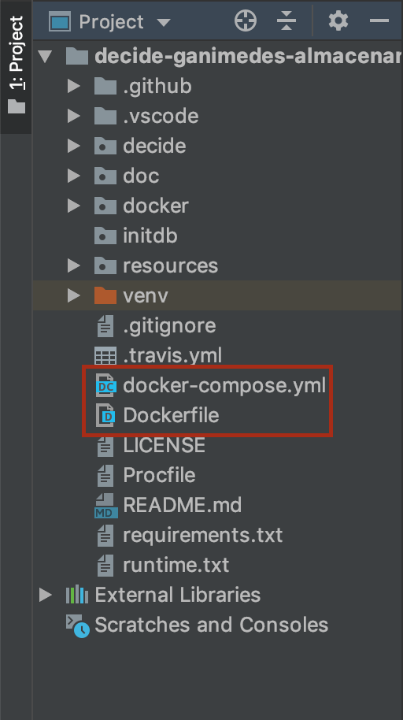

# Entorno de desarrollo Docker

Entorno de desarrollo creado con Docker. Este entorno de desarrollo será usado por los integrantes del equipo de desarrollo de decide-ganimedes-almacenamiento de la asignatura Evolución y Gestión de la configuración del curso 2018-19.

El entorno de desarrollo crea los siguientes contendores en nuestro demonio de Docker local:

- **decide_web**
- **decide_db**
- **decide_mongo**

## Instrucciones de ejecución

Para ejecutar el entorno de desarrollo con Docker hay que seguir los siguientes pasos:

1. Incluir los ficheros "Dockerfile" y "docker-compose.yml" en la raiz de nuestro proyecto.

2.Estandon en la raiz del proyecto de decide, ejecutar el siguiente comando:

    $ docker-compose up -d

3.En el caso de queramos volver a construir la imagen de Decide sin parar los contenedores, habrá que ejecutar el siguiente comando:

    $ docker-compose build

4.Por último para parar todos los contenedores relacionados con Decide, utilizar el siguiente comando:

    $ docker-compose down

## Posible comandos necesarios despues de la ejecución

Crear un usuario administrador:

    $ docker exec -ti decide_web ./decide/manage.py createsuperuser

Lanzar la consola django:

    $ docker exec -ti decide_web ./decide/manage.py shell

Lanzar tests:

    $ docker exec -ti decide_web ./decide/manage.py test

Lanzar una consola SQL:

    $ docker exec -ti decide_db ash -c "su - postgres -c 'psql postgres'"